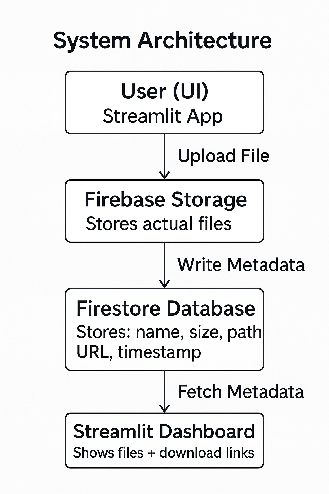
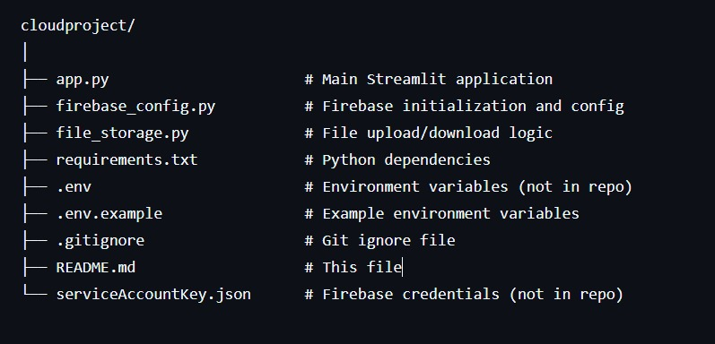

# ☁ Mini Cloud-Drive System

A lightweight cloud-based file storage system built with Streamlit and Firebase, demonstrating the fundamentals of cloud storage, frontend integration, metadata management, and secure file-handling practices.

## 🎯 Problem Statement

Modern applications require secure, scalable, and user-friendly file storage systems. Traditional local storage solutions have limitations such as:
- Lack of scalability
- Device dependency
- Low accessibility
- Complex infrastructure requirements

This project addresses these challenges by providing a *lightweight, cloud-based file management system* that allows users to upload, store, and retrieve files safely without setting up complex infrastructure.

## 💡 Solution Overview

 A cloud-based file upload and storage system using:

- *Frontend UI:* Streamlit - for rapid, interactive web application development
- *Cloud Storage:* Firebase Storage - for reliable file storage
- *Database:* Firestore - for metadata management

The system allows users to upload files up to *10 MB*that are stored directly in the cloud. File details such as name, size, MIME type, storage path, and download URL are stored in Firestore. A clean dashboard displays all stored files and allows users to download them.

## 🏗 System Architecture


## ✨ Features

- ✅ Drag-and-drop file upload (10 MB limit)
- ✅ Cloud-based storage (Firebase Storage)
- ✅ Metadata stored in Firestore
- ✅ Dashboard to view file list with details
- ✅ Download links accessible from UI
- ✅ Real-time sync
- ✅ Storage path tracing for demonstration
- ✅ Clean architecture and simple codebase
- ✅ File deletion functionality
- ✅ Storage statistics display
- ✅ Professional and user-friendly UI

## 🛠 Tech Stack

| Component | Technology | Purpose |
|-----------|-----------|---------|
| Frontend | Streamlit | Interactive web UI |
| Cloud Storage | Firebase Storage | File storage |
| Database | Firestore | Metadata management |
| Backend | Python | Application logic |
| Authentication | Firebase Admin SDK | Secure cloud access |

## 📦 Prerequisites

Before you begin, ensure you have the following installed:

- *Python 3.8 or higher*
- *pip* (Python package manager)
- *Firebase account* (free tier is sufficient)
- *Firebase project* with Storage and Firestore enabled

## 🚀 Installation

### 1. Clone or Download the Project
      cd cloudproject

### 2. Install Dependencies
      pip install -r requirements.txt

The required packages are:
- streamlit==1.31.0 - Web application framework
- firebase-admin==6.4.0 - Firebase Admin SDK
- python-dotenv==1.0.1 - Environment variable management

## ⚙ Configuration

### Step 1: Set Up Firebase Project

1. Go to [Firebase Console](https://console.firebase.google.com/)
2. Create a new project or select an existing one
3. Enable *Firebase Storage*:
   - Navigate to Storage in the left menu
   - Click "Get Started"
   - Choose security rules (start in test mode for development)
4. Enable *Firestore Database*:
   - Navigate to Firestore Database
   - Click "Create Database"
   - Start in test mode

### Step 2: Download Service Account Key

1. In Firebase Console, go to *Project Settings* (gear icon)
2. Navigate to *Service Accounts* tab
3. Click *Generate New Private Key*
4. Download the JSON file
5. Rename it to serviceAccountKey.json
6. Place it in the project root directory (/home/priyal/Mini_Cloud/Project/)

### Step 3: Configure Environment Variables

1. Create a .env file in the project root directory:
   ```bash
   touch .env
   

2. Edit the .env file with the following content:
   env
   FIREBASE_CREDENTIALS_PATH=serviceAccountKey.json
   FIREBASE_STORAGE_BUCKET=your-project-id.firebasestorage.app
   

   *Important Notes:*
   - Replace your-project-id with your actual Firebase project ID (found in Firebase Console)
   - Use the .firebasestorage.app format for newer Firebase projects
   - Or use .appspot.com format if that's what your Firebase Console shows
   - To find your bucket name, check Firebase Console → Storage → Files tab → Look at the folder path (e.g., gs://cloud-8ad2c.firebasestorage.app)

### Step 4: Update Security Rules (Production)

For production use, update Firebase Storage rules:


rules_version = '2';
service firebase.storage {
  match /b/{bucket}/o {
    match /{allPaths=**} {
      allow read, write: if request.auth != null;
    }
  }
}


## 🎮 Usage

### Running the Application

1. Make sure you're in the project directory:
   ```bash
   cd /home/raghav/cloudproject
   

2. Run the Streamlit application:
   ```bash
   streamlit run app.py
   

3. The application will open in your default browser at http://localhost:8501

### Using the Application

#### Upload Files Tab

1. Click *"Browse files"* or drag and drop a file
2. Review file details (name, size, type)
3. Click *"🚀 Upload to Cloud"*
4. View upload confirmation and details
5. Copy download URL or storage path if needed

#### My Files Tab

1. View all uploaded files in a table format
2. See storage statistics (total files, total size)
3. Click on file entries to expand details
4. Download files using the provided links
5. Delete files using the delete button
6. Refresh the list using the refresh button

## 📁 Project Structure


### File Descriptions

- **app.py**: Main Streamlit application with UI components and user interactions
- **firebase_config.py**: Handles Firebase Admin SDK initialization and provides access to Storage and Firestore
- **file_storage.py**: Contains the FileStorageManager class with methods for upload, download, delete, and metadata management
- **requirements.txt**: Lists all Python package dependencies
- **.env**: Stores sensitive configuration (credentials path, bucket name)
- **serviceAccountKey.json**: Firebase service account credentials (keep secure!)

## 🔧 How It Works

### File Upload Flow

1. *User selects file* in Streamlit UI
2. *File validation* checks if size is under 10 MB
3. *Generate unique filename* with timestamp
4. *Upload to Firebase Storage* in uploads/ folder
5. *Make file publicly accessible* and get download URL
6. *Create metadata object* with all file details
7. *Store metadata in Firestore* collection
8. *Display success message* with upload details

### File Retrieval Flow

1. *Query Firestore* for all documents in the files collection
2. *Fetch metadata* including download URLs
3. *Display in table* with sortable columns
4. *Provide download links* for each file
5. *Show detailed view* in expandable sections

### File Deletion Flow

1. *User clicks delete* on a file
2. *Delete from Firebase Storage* using storage path
3. *Delete metadata from Firestore* using document ID
4. *Refresh UI* to show updated file list

## 🔐 Security Notes

*Important:* For demonstration and learning purposes, this project uses public file access. For production use:

1. Implement proper authentication
2. Use Firebase Authentication
3. Set up proper security rules
4. Never commit serviceAccountKey.json to version control
5. Use environment-specific configurations
6. Implement rate limiting
7. Add virus scanning for uploaded files

## 🎓 Educational Value

This project demonstrates:

- *Cloud Storage Integration*: Working with Firebase Storage API
- *Database Operations*: CRUD operations with Firestore
- *File Handling*: Upload, download, and metadata management
- *Web Development*: Building interactive UIs with Streamlit
- *Configuration Management*: Using environment variables
- *Error Handling*: Graceful failure and user feedback
- *Code Organization*: Modular architecture with separation of concerns

## 🐛 Troubleshooting

### Common Issues

#### 1. Firebase initialization fails
*Error*: Failed to initialize Firebase

*Solutions*:
- Verify serviceAccountKey.json exists in the project root
- Check that .env file has correct FIREBASE_CREDENTIALS_PATH
- Ensure the service account key file is valid JSON
- Verify Firebase Admin SDK is installed: pip install firebase-admin

#### 2. "The specified bucket does not exist" error
*Error*: 404 POST https://storage.googleapis.com/upload/storage/v1/b/...

*Solutions*:
- Enable Firebase Storage in Firebase Console (Build → Storage → Get Started)
- Verify the bucket name in .env matches your Firebase Console
- Check the bucket format:
  - Newer projects: project-id.firebasestorage.app
  - Older projects: project-id.appspot.com
- Find your actual bucket name in Firebase Console → Storage → Files → Check the folder path

#### 3. "name 'firestore' is not defined" error
*Error*: Error retrieving files: name 'firestore' is not defined

*Solutions*:
- Ensure file_storage.py has the correct import:
  python
  from firebase_admin import firestore
  
- Restart the Streamlit application after making changes

#### 4. File upload fails
*Error*: The Upload button shows an error message

*Solutions*:
- Check Firebase Storage is enabled in Firebase Console
- Verify bucket name in .env is correct
- Check file size is under 10 MB
- Review Firebase Storage security rules

#### 5. Import errors
*Error*: ModuleNotFoundError: No module named 'streamlit' or similar

*Solutions*:
- Activate virtual environment: source venv/bin/activate
- Install dependencies: pip install -r requirements.txt
- If requirements.txt is missing, install manually:
  bash
  pip install streamlit firebase-admin python-dotenv pandas
  

#### 6. Permission denied errors
*Error*: Permission errors when accessing Storage or Firestore

*Solutions*:
- Update Firebase Storage security rules to allow read/write
- Update Firestore security rules to allow read/write
- For development, use test mode (allows all operations)
- For production, implement proper authentication

#### 7. Virtual environment not activated
*Symptoms*: Commands not found or wrong Python version

*Solutions*:
- Activate virtual environment:
  bash
  source venv/bin/activate  # Linux/Mac
  venv\Scripts\activate     # Windows
  
- Verify activation by checking the terminal prompt (should show (venv))

#### 8. Streamlit app shows blank page
*Solutions*:
- Check browser console for JavaScript errors
- Clear browser cache and reload
- Try accessing from a different browser
- Check terminal for Python errors

## 📚 API Reference

### firebase_config.py

#### initialize_firebase()
Initializes Firebase Admin SDK with credentials and storage bucket.

*Parameters*: None

*Returns*: None

*Raises*:
- ValueError: If FIREBASE_CREDENTIALS_PATH or FIREBASE_STORAGE_BUCKET are not set in .env
- Exception: If Firebase initialization fails

*Example*:
python
from firebase_config import initialize_firebase
initialize_firebase()


#### get_storage_bucket()
Returns the Firebase Storage bucket instance. Initializes Firebase if not already done.

*Parameters*: None

*Returns*: storage.bucket() instance

*Example*:
python
from firebase_config import get_storage_bucket
bucket = get_storage_bucket()
blob = bucket.blob('path/to/file.txt')


#### get_firestore_db()
Returns the Firestore database instance. Initializes Firebase if not already done.

*Parameters*: None

*Returns*: firestore.client() instance

*Example*:
python
from firebase_config import get_firestore_db
db = get_firestore_db()
collection = db.collection('files')


### file_storage.py

#### Class: FileStorageManager

Main class for managing file operations with Firebase Storage and Firestore.

##### __init__()
Initializes the FileStorageManager with Storage bucket and Firestore database.

*Example*:
python
from file_storage import FileStorageManager
manager = FileStorageManager()


##### upload_file(uploaded_file)
Uploads a file to Firebase Storage and stores metadata in Firestore.

*Parameters*:
- uploaded_file (UploadedFile): Streamlit UploadedFile object from file_uploader

*Returns*:
python
{
    'success': bool,           # True if upload succeeded
    'metadata': dict,          # File metadata (if success=True)
    'doc_id': str,            # Firestore document ID (if success=True)
    'error': str              # Error message (if success=False)
}


*Metadata Structure*:
python
{
    'original_name': str,      # Original filename
    'stored_name': str,        # Stored filename with timestamp
    'size_bytes': int,         # File size in bytes
    'size_mb': float,          # File size in MB (rounded to 2 decimals)
    'mime_type': str,          # MIME type of the file
    'storage_path': str,       # Path in Firebase Storage
    'download_url': str,       # Public download URL
    'uploaded_at': datetime,   # Upload timestamp
    'file_extension': str      # File extension (e.g., '.pdf')
}


*Example*:
python
result = manager.upload_file(uploaded_file)
if result['success']:
    print(f"File uploaded: {result['metadata']['download_url']}")
else:
    print(f"Upload failed: {result['error']}")


##### get_all_files()
Retrieves all file metadata from Firestore, ordered by upload date (newest first).

*Parameters*: None

*Returns*: List of file metadata dictionaries (includes 'id' field for each file)

*Example*:
python
files = manager.get_all_files()
for file in files:
    print(f"{file['original_name']} - {file['size_mb']} MB")


##### delete_file(doc_id, storage_path)
Deletes a file from Firebase Storage and removes its metadata from Firestore.

*Parameters*:
- doc_id (str): Firestore document ID
- storage_path (str): Path to file in Firebase Storage (e.g., 'uploads/filename.pdf')

*Returns*:
python
{
    'success': bool,           # True if deletion succeeded
    'message': str,            # Success message (if success=True)
    'error': str              # Error message (if success=False)
}


*Example*:
python
result = manager.delete_file('doc123', 'uploads/20240115_120000_file.pdf')
if result['success']:
    print("File deleted successfully")


##### get_storage_stats()
Calculates and returns storage statistics.

*Parameters*: None

*Returns*:
python
{
    'total_files': int,        # Total number of files
    'total_size_bytes': int,   # Total size in bytes
    'total_size_mb': float     # Total size in MB (rounded to 2 decimals)
}


*Example*:
python
stats = manager.get_storage_stats()
print(f"Total: {stats['total_files']} files, {stats['total_size_mb']} MB")


### Constants

#### MAX_FILE_SIZE_MB
Maximum allowed file size in megabytes.

*Type*: int

*Default*: 10

*Usage*: Modify in file_storage.py to change upload size limit

#### MAX_FILE_SIZE_BYTES
Maximum allowed file size in bytes (calculated from MAX_FILE_SIZE_MB).

*Type*: int

*Default*: 10485760 (10 * 1024 * 1024)

## 🔧 Configuration Options

### Modifying File Size Limit
To change the maximum upload size, edit file_storage.py:

python
# Line 11
MAX_FILE_SIZE_MB = 20  # Change from 10 to 20 MB


### Changing Storage Path

To modify where files are stored, edit file_storage.py in the upload_file method:

python
# Line 48
blob = self.bucket.blob(f"my_custom_folder/{unique_filename}")


### Changing Firestore Collection Name

To use a different collection name, edit file_storage.py:

python
# Line 20
self.collection_name = 'my_files'  # Change from 'files'


### Customizing File Naming

To modify how uploaded files are named, edit file_storage.py:

python
# Lines 42-45
timestamp = datetime.now().strftime('%Y%m%d_%H%M%S')
unique_filename = f"{timestamp}_{original_name}"
# Change to:
unique_filename = f"custom_prefix_{timestamp}_{original_name}"


## 🚀 Deployment

### Deploying to Streamlit Cloud

1. Push your code to GitHub (exclude .env and serviceAccountKey.json)
2. Go to [Streamlit Cloud](https://streamlit.io/cloud)
3. Connect your GitHub repository
4. Add secrets in Streamlit Cloud settings:
   - FIREBASE_CREDENTIALS_PATH
   - FIREBASE_STORAGE_BUCKET
5. Upload serviceAccountKey.json as a secret file
6. Deploy the application

### Deploying to Other Platforms

For deployment to platforms like Heroku, Railway, or Render:

1. Add a Procfile:
   
   web: streamlit run app.py --server.port $PORT
   

2. Set environment variables on the platform
3. Upload service account key securely
4. Configure Firebase Storage CORS if needed

## 📝 License

This is an educational project. Feel free to use and modify for learning purposes.

## 👨‍💻 Author

*Raghav*

Created as a cloud storage demonstration project.

## 🙏 Acknowledgments

- Firebase for providing cloud infrastructure
- Streamlit for the amazing web framework
- Python community for excellent libraries
- Google Cloud Platform for storage services

## 📞 Support

If you encounter any issues:

1. Check the [Troubleshooting](#-troubleshooting) section
2. Review [Firebase Documentation](https://firebase.google.com/docs)
3. Check [Streamlit Documentation](https://docs.streamlit.io)
4. Open an issue on GitHub (if applicable)

## 🔄 Version History

### Version 1.0.0 (Current)
- Initial release
- File upload functionality
- Firebase Storage integration
- Firestore metadata management
- File listing and download
- File deletion
- Storage statistics
- Responsive UI

## 🎯 Future Roadmap

- [ ] User authentication (Firebase Auth)
- [ ] File sharing with permissions
- [ ] Folder organization
- [ ] Advanced search and filtering
- [ ] Bulk operations (upload/download multiple files)
- [ ] File preview (images, PDFs, videos)
- [ ] Drag-and-drop upload interface
- [ ] Progress bars for large uploads
- [ ] File versioning
- [ ] Storage quota management
- [ ] Email notifications
- [ ] File encryption
- [ ] Automated backups
- [ ] Admin dashboard
- [ ] API endpoints

---

*Note*: This is a learning project designed to demonstrate cloud storage concepts. For production use, implement proper authentication, security measures, error handling, and follow security best practices.
